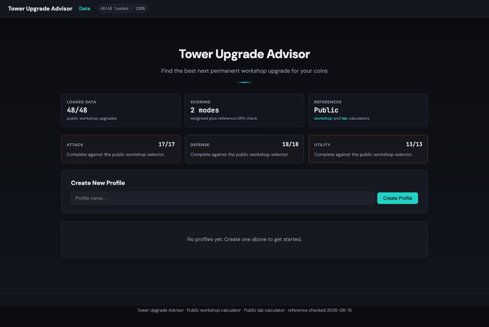

<div align="center">
  <picture>
    <source media="(prefers-color-scheme: dark)" srcset="docs/assets/logo-dark.svg">
    <source media="(prefers-color-scheme: light)" srcset="docs/assets/logo-light.svg">
    
  </picture>

  # Tower Upgrade Advisor

  Local-first planner for choosing the next best permanent workshop upgrade in **The Tower**.

 **iOS App Store: [The Tower - Idle Tower Defense](https://apps.apple.com/vc/app/the-tower-idle-tower-defense/id1575590830)**

  **Live app: [tower-upgrade-advisor.vercel.app][demo-url]**
</div>

<div align="center">

[![Live on Vercel][vercel-shield]][demo-url]
[![Data: 48/48][data-shield]][workshop-url]
[![Python 3.11+][python-shield]][python-url]
[![License: MIT][license-shield]][license-url]

</div>

<div align="center">
  <a href="#quick-start">Quick Start</a> &middot;
  <a href="#when-to-use-it">When to Use It</a> &middot;
  <a href="#data-and-verification">Data</a> &middot;
  <a href="#contributing">Contributing</a>
</div>

<br>



## Why

The Tower's workshop upgrades compete for the same coin budget, but their effects use different units: damage, attack speed, health, recovery, free upgrades, level skips, and more. Tower Upgrade Advisor gives players a clear next-buy recommendation without hiding the assumptions behind a single magic score.

If you are tracking a build and want to compare upgrade efficiency before spending coins, this is for you. It is not a full run simulator, module planner, or replacement for in-game judgment.

## Features

- **Complete public workshop coverage** - validates all 48 upgrades exposed by the public workshop calculator.
- **Transparent next-buy ranking** - ranks upgrades by marginal benefit per coin with visible Attack, Defense, and Utility weights.
- **Reference DPS check** - compares attack recommendations against the public DPS formula source where that model applies.
- **Local profile tracking** - stores multiple build profiles as local JSON files during local use.
- **Readable data browser** - shows per-level cost and effect tables with category coverage status.
- **Repeatable verification** - includes linting, type checks, tests, data validation, public-site coverage checks, and route stress tests.

## When to Use It

Use it when you want to decide what to buy next from the permanent workshop. It is especially useful when you have a coin budget and want to compare attack, defense, and utility priorities without hand-checking dozens of tables.

Look elsewhere if you need exact hidden game internals, wave/run simulation, card/module optimization, or account syncing. The bundled data is based on visible public calculator values and may reflect display rounding at very high costs.

## Quick Start

```bash
python -m venv .venv
. .venv/bin/activate
pip install -e ".[dev]"
python app.py
```

Then open the local Flask URL printed by the server.

## Install

Requirements:

| Tool | Version |
| --- | --- |
| Python | 3.11+ |
| pip | bundled with Python |
| Node.js/npm | optional, only for Playwright scraper tooling |

From source:

```bash
git clone https://github.com/Nebulazer123/tower-upgrade-advisor.git
cd tower-upgrade-advisor
python -m venv .venv
. .venv/bin/activate
pip install -e ".[dev]"
```

Optional extraction tooling:

```bash
make install-extract
```

## Usage

1. Create a profile for a build.
2. Enter available coins.
3. Fill current workshop levels.
4. Open recommendations and adjust Attack, Defense, and Utility weights.
5. Use the Reference Check card to compare supported attack picks with the public DPS source model.

The Vercel demo uses ephemeral storage, so public demo profiles are temporary. Local runs save profiles under `data/profiles/`, which is intentionally ignored by git and Vercel.

## Data and Verification

Public references:

- [Tower Workshop Calculator][workshop-url]
- [Tower Lab Calculator][lab-url]
- [Reference DPS source][dps-source-url]

Current bundled coverage:

| Category | Loaded | Public reference |
| --- | ---: | ---: |
| Attack | 17 | 17 |
| Defense | 18 | 18 |
| Utility | 13 | 13 |
| Total | 48 | 48 |

The visible-table scraper exists because the public calculator pads raw DOM text with hidden zero-font characters. Use the maintained scraper instead of raw `textContent` extraction:

```bash
python scripts/verify_data_coverage.py --strict
python scripts/verify_site_structure.py
python scripts/scrape_public_workshop_visible.py --merge
```

## Development

```bash
make lint
make typecheck
make test
make validate
make coverage-report
make stress
```

Deployment is configured for Vercel Services with `app.py` as the Flask entrypoint. The production app is currently deployed at [tower-upgrade-advisor.vercel.app][demo-url].

## Public Repo Notes

- `data/raw/`, `data/profiles/`, caches, and local virtual environments are ignored.
- `.vercelignore` keeps local profile data out of deployments.
- `.github/repo-meta.yml` contains a proposed GitHub About description, homepage, and topics. Apply it manually or with `gh repo edit` after maintainer review.
- The security contact in [SECURITY.md](SECURITY.md) still needs a dedicated maintainer channel or GitHub private vulnerability reporting enabled.

## Contributing

Issues and pull requests are welcome. See [CONTRIBUTING.md](CONTRIBUTING.md) for setup, verification, and data-change guidance.

## License

MIT - see [LICENSE](LICENSE).

[demo-url]: https://tower-upgrade-advisor.vercel.app
[workshop-url]: https://tower-workshop-calculator.netlify.app/
[lab-url]: https://tower-lab-calculator.netlify.app/
[dps-source-url]: https://github.com/jacoelt/tower-calculator
[python-url]: https://www.python.org/
[license-url]: LICENSE
[vercel-shield]: https://img.shields.io/badge/Vercel-live-000000?logo=vercel&logoColor=white
[data-shield]: https://img.shields.io/badge/workshop%20data-48%2F48-2dd4bf
[python-shield]: https://img.shields.io/badge/python-3.11%2B-3776AB?logo=python&logoColor=white
[license-shield]: https://img.shields.io/badge/license-MIT-blue
